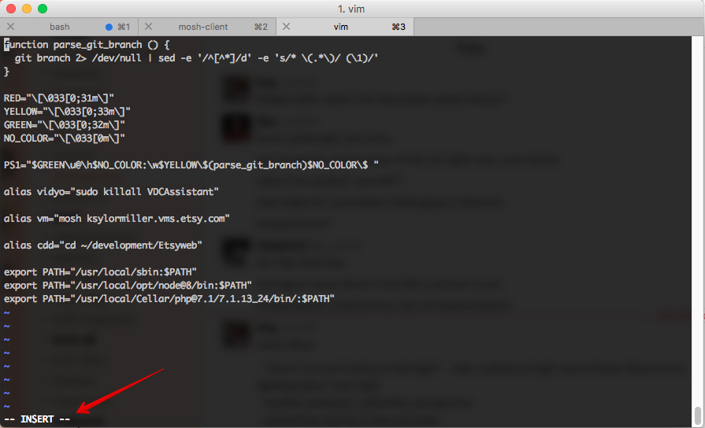

# Exercise 2 - Commits, Branches, Refs and HEAD
Let's learn more about some fundamental data structures

## Prework
Set up your terminal/command line to show the current directory and the currently checked out git branch. (image)

On Mac and Unix machines, the terminal is actually a *bash shell* program, which allows you to running commands that interact directly with your computer. Instructions are written in a language called bash. 

We can customize our bash environment to do all kinds of cool stuff using what's called a bash profile. The bash profile is a helper script that gets run whenever you open up a bash shell like the terminal (or iterm, etc.). So, let's use a pre-built script to show us some useful information and color-code it.

1. In the command line, run the command `vim ~/.bash_profile`. This will either open the existing file in the Vim editor, or it will create the file if it doesn't exist. Vim is super confusing if you've never used it before, but we can get through this!

2. When Vim opens a new file, it starts in a read-only mode. You cannot modify the file, only look at it. Hit the `I` key to enter vim's `insert` mode. This will allow you to enter text. You will see `-- INSERT --` at the bottom of the window. 



3. Copy/paste the following block of code into the bash_profile file. If you already have stuff in your bash_profile, use the down arrow and right arrow keys until you are at the end of that text, then hit enter to move onto a new line before you paste. 

```bash
function parse_git_branch () {
  git branch 2> /dev/null | sed -e '/^[^*]/d' -e 's/* \(.*\)/ (\1)/'
}

RED="\[\033[0;31m\]"
YELLOW="\[\033[0;33m\]"
GREEN="\[\033[0;32m\]"
NO_COLOR="\[\033[0m\]"

PS1="$GREEN\u@\h$NO_COLOR:\w$YELLOW\$(parse_git_branch)$NO_COLOR\$ "
```

4. Hit the escape key to exit `insert` mode. The bottom line will be blank.

5. Type a colon `:` by hitting `shift + ;` this gets vim ready to accept an operational command.

6. Tell vim that you want to **write** the contents of the file (e.g. save the changes you made), then **quit** the program by typing `w` then `q` then hit `enter` to execute the commands.

**[Woooo! you successfully quit out of vim!](https://stackoverflow.blog/2017/05/23/stack-overflow-helping-one-million-developers-exit-vim/)**

7. Now we need to tell your current shell session that we want to run and use that command. we do that with the command `source ~/.bash_profile`

8. Hopefully this has changed your bash prompt, if not, let me know!

## Check out the refs
Let's take a look at some git internals - references, or refs, and the HEAD.

1. First, let's take a look at the current state of our repo. We'll start by seeing what branch we have checked out. We just added that information to our bash prompt, of course, but there are a few other ways to check it. Let's do the most roundabout way - by looking at the HEAD reference. 

2.  We can see what branch is checked out by looking at the HEAD reference. Run the command `cat .git/HEAD` (cat is short for concatenate, and is a quick and easy way to output the contents of a file in the command line) this should output `ref: refs/heads/master` This means that HEAD is pointing to the branch `master`, which is another ref.

3. Run `cat .git/refs/heads/master`. This outputs the content of the file `refs/heads/master`, which is how git "knows" what commit the master branch points to. It will be a 40-character hash representing a commit.

## Commit time!
Now let's add a commit to our master branch and see how these refs change! 

1. Edit any of the placeholder files you added to your repo in exercise 1 using the text editor of your choice, and save the changes.

2. Run the command `git add .` to add your changed file to the staging area (we'll get into what this means in the next section).

3. Run `git commit -m "Your message goes here"` to save those changes as a new commit. You should see something along the lines of the output:

```bash
[master <first 7 digits of new hash>] Your message goes here
 1 file changed, 1 insertion(+)
 ```

4. Now let's check back in with our ref files! run `cat .git/HEAD` - this should still be the same result as before `ref: refs/heads/master`, because we still have the master branch checked out.

5. Next, run the command `cat .git/refs/heads/master`. Compare this hash to the previous one - it should be different, and it should be the same first 7 digits as the hash git output after we ran the commit in step 3.

## How about a branch? 

1. Let's create a new branch in the project. Run the command `git branch new-branch-name`. (you can use any name you want, just remember to replace the name in the next few steps)

2. This created a new ref file. We can view it using `cat .git/refs/heads/new-branch-name`. Right now, it contains the same commit that master points to. 

3. Checkout our new branch with `git checkout new-branch-name`.

4. Run `cat .git/HEAD` to see that indeed, our HEAD now points to the new branch. This means that from now on, all of the commands we run will happen to the new branch.

5. Next, let's make another commit - follow steps 1-3 in "Commit time!" to create a new commit on our new branch. 

6. Run `cat .git/refs/heads/new-branch-name` and then `cat .git/refs/heads/master` to confirm that indeed, each branch now has a different commmit at it's tip. 

**Pro tip:** You can both create _and_ checkout a branch at the same time using the command `git checkout -b new-branch-name`. Isn't it awesome that git is so consistent in its command names? So intuitive, right? `</sarcasm>`

_Bonus extra work:_ Run the command `git branch` with no arguments to see what it outputs. How do you think this command works under the hood? 


