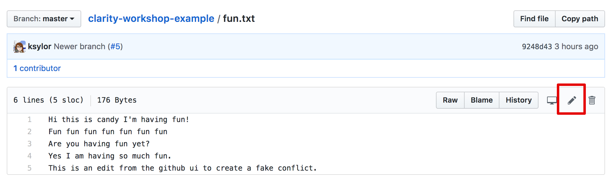
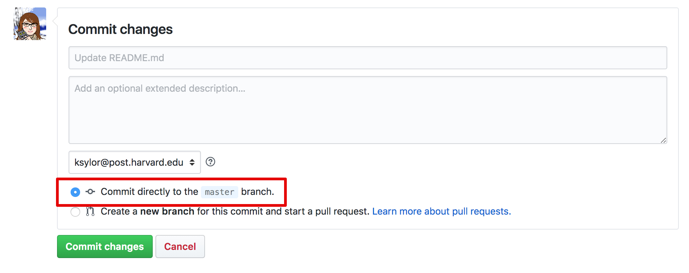

# Workflow

In this exercise we'll practice some common workflow operations and get more familiar with the different environments in git.

## Modify files and add to staging/index

Let's practice modifying files in the command line using vim, then adding those files to staging.

1. Open up the terminal/command line and make sure you have the master branch checked-out in the repo you created.

2. Choose any file in your example repo to edit, and open it up using vim by typing the command `vim <filename>`.

3. Type `i` to put vim into edit mode.

4. Use the up and down arrows to navigate around the file, add some new lines and/or change some existing lines of text.

5. When you are ready to save, hit `esc` to go back into command mode. then colon `:` `w` `q` and `enter` to tell vim you want to write out the file and quit. 

6. Run the command `git diff`. You should see something like this for output:

```diff
diff --git a/fun.txt b/fun.txt
index ee2280c..21b7d7d 100644
--- a/fun.txt
+++ b/fun.txt
@@ -1,2 +1,3 @@
 Hi this is candy I'm having fun!
 Are you having fun yet?
+Yes I am having so much fun.
```

7. Run the command `git status`. You should see something like this:
```
On branch master
Your branch is up-to-date with 'origin/master'.

Changes not staged for commit:
  (use "git add <file>..." to update what will be committed)
  (use "git checkout -- <file>..." to discard changes in working directory)

	modified:   fun.txt

no changes added to commit (use "git add" and/or "git commit -a")
```

8. Follow steps 2-5 using a different file. If you only have one file in your repo, running the command `vim <new-filename>` will both create and open a new file.

9. Run `git diff` and `git status` again to confirm that you've changed both files. 

10. Choose one of the two files that you've changed and add it to the staging area with `git add <filename>`.

11. Run `git status` again. Now you should see one file in "Changes to be committed" - AKA in staging, and the other file in "Changes not staged for commit" aka the workspace.
```
On branch master
Your branch is up-to-date with 'origin/master'.

Changes to be committed:
  (use "git reset HEAD <file>..." to unstage)

	modified:   fun.txt

Changes not staged for commit:
  (use "git add <file>..." to update what will be committed)
  (use "git checkout -- <file>..." to discard changes in working directory)

	modified:   the-most-fun.txt
```
  
12. Run `git diff` again. The file in staging dissapeared! Run `git diff --staged` (or the alias `git diff --cached` does the same thing) to see the file in staging. Run `git diff HEAD` to see both files.

13. What happens if you edit the file in staging, then run `git status` and `git diff` again? 

14. Commit _just_ the file in staging with `git commit -m "Your message here"` 

15. Run `git status` again. The changes in staging are gone, they've been committed. But your workspace changes are still there. 

16. Add and commit the remaining changes. 

17. Now if we run `git status` we should see something like
```
On branch master
Your branch is ahead of 'origin/master' by 2 commits.
  (use "git push" to publish your local commits)

nothing to commit, working tree clean
```
18. Let's push those changes up to origin! Run `git push`. You should see something like:

```
Counting objects: 6, done.
Delta compression using up to 8 threads.
Compressing objects: 100% (5/5), done.
Writing objects: 100% (6/6), 580 bytes | 580.00 KiB/s, done.
Total 6 (delta 2), reused 0 (delta 0)
remote: Resolving deltas: 100% (2/2), completed with 1 local object.
To https://github.com/ksylor/clarity-workshop-example.git
   995198f..39b50af  master -> master
```

19. Now if we run `git status` again, we should be up to date!
```
On branch master
Your branch is up-to-date with 'origin/master'.

nothing to commit, working tree clean
```

## Merge vs Rebase

Now we'll practice making merge and rebase commits.

1. First, we need to create a conflict, so let's edit the remote master branch directly in the Github UI. Open up the repo you created in github.com.

2. Click on one of your files, and click the pencil icon to edit it.



3. Change some text in the file. Then, in the "Commit Changes" box below the text editor, enter "Their changes" as the commit message. Select "Commit directly to the `master` branch", and click "Commit changes". 



4. Go back to your repo in your terminal. _Do not `git pull` or `git fetch` yet_. Make sure you have the `master` branch checked out.

5. Open up a different file than the one you just edited in vim and change it's contents. Refer to the earlier exercise if you've forgotten the vim hotkeys.

6. Stage, then commit your changes with the message "My changes". (Tip: You can stage and commit in the same command using `git commit -am "My changes"`, but use that command wisely!)

7. Run `git status`. You should see something like:

```
On branch master
Your branch is ahead of 'origin/master' by 1 commit.
  (use "git push" to publish your local commits)

nothing to commit, working tree clean
```

8. As you can see, git _thinks_ that we can fast-forward, but that's a lie! Git doesn't know about the conflicting changes on github yet, we need to update our tracking branches.

9. Run `git fetch` to update your `origin/master` tracking branch, then `git status`. You should now see something like:

```
On branch master
Your branch and 'origin/master' have diverged,
and have 1 and 1 different commits each, respectively.
  (use "git pull" to merge the remote branch into yours)

nothing to commit, working tree clean
```

10. What happens if you try to `git push`? Try it! You'll see something like:

```
git push
To github.com:ben-ng/clarity-workshop-example.git
 ! [rejected]        master -> master (non-fast-forward)
error: failed to push some refs to 'git@github.com:ben-ng/clarity-workshop-example.git'
hint: Updates were rejected because the tip of your current branch is behind
hint: its remote counterpart. Integrate the remote changes (e.g.
hint: 'git pull ...') before pushing again.
hint: See the 'Note about fast-forwards' in 'git push --help' for details.
```

12. Now we'll resolve this the ugly way -- with a merge commit. Run git's suggested command `git pull`, which if you recall, is equivalent to `git fetch && git merge`. 

13. You'll get a vim editor with a pre-filled commit message `"Merge branch 'master' of <your branch>"`. Approve this message by saving & writing it back to git with the command `:x` (which is shorthand for `:wq`). You'll see something like this:

```
Merge made by the 'recursive' strategy.
 fun.txt | 2 +-
 1 file changed, 1 insertion(+), 1 deletion(-)
```

14. Take a look at the last three commits with `git log --graph -3`. The `--graph` flag wil show us a visual indicator of the connections between commits (we'll talk some more about git log in the section on viewing and changing history!). 

You'll see our merge commit, and its two parent commits in the `Merge: 785f968 daad8d8` line:

```
*   commit 6622eb5f8a7f10083654f5f5b45cf8d8e0f430fc (HEAD -> master)
|\  Merge: 785f968 daad8d8
| | Author: Katie Sylor-Miller <ksylormiller@etsy.com>
| | Date:   Sun Dec 9 18:00:08 2018 -0500
| |
| |     :Merge branch 'master' of https://github.com/ksylor/clarity-workshop-example
| |
| * commit daad8d877915f029f18f3fdd9d3ba6fa60e2f261 (origin/master)
| | Author: Katie Sylor-Miller <ksylor@post.harvard.edu>
| | Date:   Sun Dec 9 17:58:49 2018 -0500
| |
| |     Their changes
| |
* | commit 785f9687b40037ff9e35e7220ad7a3d7587a6a78
|/  Author: Katie Sylor-Miller <ksylormiller@etsy.com>
|   Date:   Sun Dec 9 17:59:49 2018 -0500
|
|       my local changes
```

Grosssssss right?

15. Now let's undo this merge operation with `git reset --hard ORIG_HEAD` (We'll cover resetting more in a bit, but this command is saying we want to reset our master back to how it was before we merged). Verify with `git log` and `git status` that it worked:

```
On branch master
Your branch and 'origin/master' have diverged,
and have 1 and 1 different commits each, respectively.
  (use "git pull" to merge the remote branch into yours)

nothing to commit, working tree clean
```

16. This time, we'll resolve the conflict the better way, by rebasing. Run `git pull --rebase`, and you'll see something like this:

```
First, rewinding head to replay your work on top of it...
Applying: My changes
```

17. This time, if you take a look at `git log --graph -3`, you'll only see `My Changes` and `Their Changes` with a nice straight line connecting them. No more nasty merge commit!

```
* commit 09a1663975fba8a6bdcc3e2316848a4f118e742d (HEAD -> master)
| Author: Katie Sylor-Miller <ksylormiller@etsy.com>
| Date:   Sun Dec 9 17:59:49 2018 -0500
|
|     My changes
|
* commit daad8d877915f029f18f3fdd9d3ba6fa60e2f261 (origin/master)
| Author: Katie Sylor-Miller <ksylor@post.harvard.edu>
| Date:   Sun Dec 9 17:58:49 2018 -0500
|
|     Their changes
|
* commit 39b50afeb8e954421105bff3cf1fbeff570fa804
| Author: Katie Sylor-Miller <ksylormiller@etsy.com>
| Date:   Sun Dec 9 11:50:58 2018 -0500
|
|     more changes
```

17. `git status` will report that you are "ahead" of `origin/master` which means you can now fast-forward:

```
On branch master
Your branch is ahead of 'origin/master' by 1 commit.
  (use "git push" to publish your local commits)

nothing to commit, working tree clean
```

18. Run `git push`. You'll see something like:

```
Counting objects: 3, done.
Delta compression using up to 8 threads.
Compressing objects: 100% (2/2), done.
Writing objects: 100% (3/3), 257 bytes | 257.00 KiB/s, done.
Total 3 (delta 1), reused 0 (delta 0)
remote: Resolving deltas: 100% (1/1), completed with 1 local object.
To github.com:ben-ng/clarity-workshop-example.git
   ac38953..bcdc487  master -> master
```

19. You're all done! Verify with `git status`:

```
On branch master
Your branch is up to date with 'origin/master'.

nothing to commit, working tree clean
```

**Congratulations! You are well on your way to Git mastery!**
