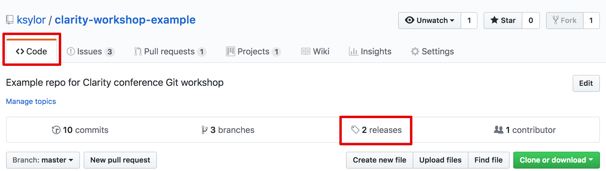
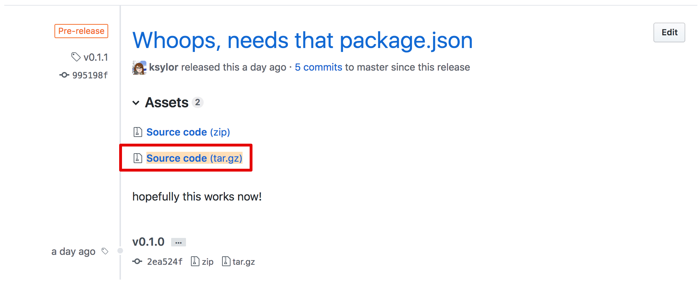
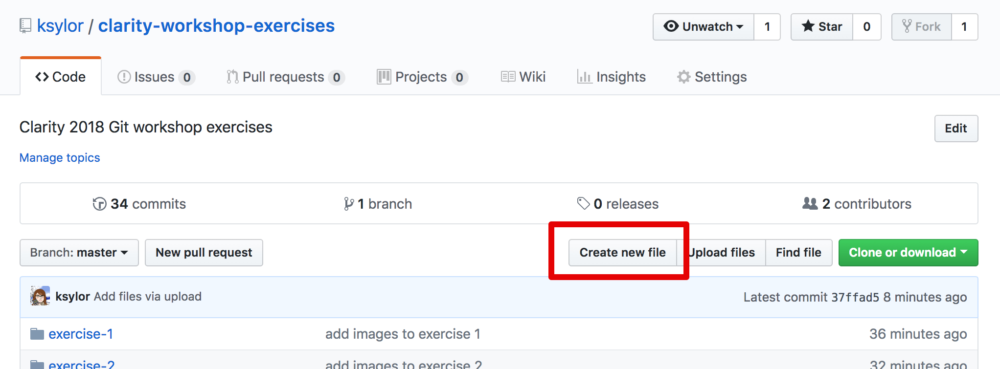

# Managing and Sharing your repo!

## Prework

Let's make sure you have node and npm installed on your machine.

1. Run the command `node -v`. You should see a version number like `v8.12.0` or similar. If not, let me know.

2. If you have node installed, check for npm. Run `npm -v`. You should see a version number like `6.4.1`. If not, let me know!

## Setup our repo as a node package

1. In your repo's root directory run the command `npm init`. This will bring up an interactive shell program that will prompt you to answer a bunch of questions. If there is text inside of parentheses, hitting `enter` will set that text as the answer. If you aren't sure what to do for any of the line items, ask! 

The only line item you should need to change are the version number (use 0.1.0) and the author field (enter your name!).

3. It will show you what your new package.json file will look like, type in `yes` and `enter` to confirm.

4. Commit your new package.json file and push it up to your github remote.

## Tag a release in Github! 

1. Navigate to the releases tab from your repo's homepage. (Click on "Code" then "Releases")

2. Click the "Create a new release" button.

3. In the "Tag Version" field, enter `v0.1.0` to match what we set in our node package. 

4. Fill out the rest of the fields and click "Publish Release".

5. In the release view, copy the link to the release `tar.gz` file.

6. Back in the command line (if you have node installed), `cd ..` to go up a directory out of the repo. Then run `npm install -g <url to tar.gz file>`. If your package was set up correctly, you should have a success message! Let me know if you don't!

Now you are all set up to share your files as a dependency that other teams can use! You can also publish this package to a public package hosting service like npm, or many companies have a private internal package manager. Ask your developers about this!

**Congratulations, you just released your code to the world!**

##Documentation

1. If you haven't already, add a README.md file to the root of your repository. Use the Github UI's "Create file" button to make it easier, we've had enough of Vim for one day :D

If you already have a README.md, click on the edit pencil in the github UI to edit it.

2. Enter some text, play around with Markdown - Github has a great article that explains their "Github Flavored Markdown" https://guides.github.com/features/mastering-markdown/. Use the "Preview" tab to see what it looks like.

3. When you are ready, commit the file directly to the master branch via the UI.

4. Navigate to the main page of your repo and enjoy your handiwork!

_Extra bonus work:_ if there is time, we can walk through the process of creating a Github Pages site.
